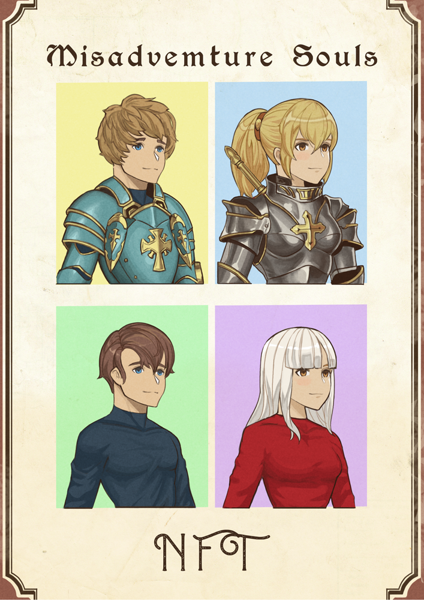

# NFTs

There will initially be three types of NFT in the Misadventure metaverse:

### Divine Remnants

.png>)

These are creatures that represent the will of the gods and pets that you can equip and that will allow you to enter dungeons where there is a chance to drop $MISAD and other NFTs. Remnants are not stronger than non-NFT pets, but they do give great stats.

#### There are 7 types of Remnants elements:

Fire

Water

Earth

Wind

Light

Dark

Beast

#### And 4 types of rarities:

Common

Uncommon

Rare

Divine

#### The element affects the bonuses the Remnant will have in a given dungeon or day, the rarity increases the NFT and $MISAD drop chances:

Common: 0% bonus

Uncommon: 10% bonus

Rare: 25% bonus

Divine: 50% bonus

### Goddess Equipment

These are equipment with rarity above transcendent that can be turned into NFTs.

_\*Players will have the option to turn any in-game item into NFT by paying a $MISAD fee_

### Lands

.png>)

Players will be able to have Lands where they can grow fruits, train pets and battle monsters.

Everyone will be able to enter other players' lands and defeat monsters or even face bosses in player lands.

All enemies defeated or resources collected generate resources that go to the landowner.

**Land defense**

Landowners will be able to place their NFTs Remnants to protect and walk their land.

The lands will function as dungeons, players will be able to attack the land and claim rewards if the landowner's NFTs are defeated.

In this case, landowners become part of the game's content, as they will be able to customize the land and its NFTs to face players.

There will be special rewards for the hardest lands to defeat!

**Main advantages of having a Land:**

\-Constant generation of resources with the visit of players&#x20;

\-Pets breeding training, obtaining NFT pets

\-Obtaining fruits, plants, food and other types of crafting materials&#x20;

\-$MISAD can be obtained by interacting with your own land

**There will also be the following rarities of lands:**

Common

Uncommon

Rare

Divine

**Rarity mainly represents the size of the land, which consequently increases the number of resources obtained:**

Common: size 1x

Uncommon: size 1.25x

Rare: size 1.5x

Divine: size 2.0x

### Misadventure Souls&#x20;

Misadventure Souls are **personalized and unique** avatars that you can show off in and out of the game! In addition, they also have unique advantages!

\-Priority pre-orders for the Misadventure metaverse

\-In-game bonuses

\-Possible airdrop target

\-Access to alpha or closed beta versions of our games!

**Limited collections**

New collections will be released every time period with limited supply.

